<h1 align="center">Eurovision Quiz</h1>

[View the live project here.](https://sofianords.github.io/eurovision-quiz/)

The Eurovision Quiz is a web application where users can test their knowledge about the Eurovision Song Contest. Through a series of engaging questions, participants can challenge themselves on Eurovision history. Whether you’re a seasoned Eurovision fan or a curious newcomer, this quiz provides an entertaining way to explore the world of Eurovision.

<h2 align="center">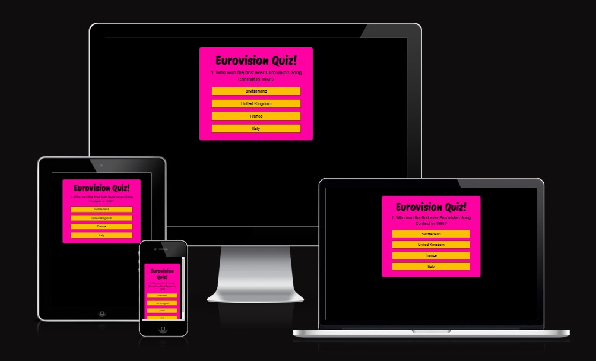</h2>

## User Experience (UX)

-   ### User stories

    -   #### User goals

        1. Start the Quiz Effortlessly:
            - Users can seamlessly begin the quiz without any need for explicit instructions. The intuitive interface guides them through the process.
        
        2. View Performance Scores and Feedback:
            - Clear feedback indicates whether their answer is correct or incorrect.
            - If a user answers incorrectly, the correct answer is provided, helping them learn from their mistakes.
            - Participants receive their quiz scores, enabling them to assess   their performance.
            - Depending on how the user performs, the feedback will be costumized.


        3. Unlimited Retries:
            - Users enjoy the freedom to retake the quiz as many times as they desire. Whether aiming for improvement or simply having fun, unlimited retries enhance the user experience.           

-   ### Design
    -   #### Layout
        - The 'Flex-box Layout Module' is used to make the layout easier, allowing it to be flexible and responsive. https://www.w3schools.com/css/css3_flexbox.asp
        - Using box-sizing:border-box property as a general style the elements are sized in a more intuitive way.
        https://www.w3schools.com/csS/css3_box-sizing.asp
        
    -   #### Colour Scheme
        - I extracted the colors from the image below, which features the Eurovision Song Contest. The text elements and body have a black background (#000000), while the ‘big-box’ background color is Hollywood Cerise (#FF01A3). The 'answer-buttons' are yellow (#FBC004). The confetti is blue (#0A2DE1) and yellow (#FBC004).

            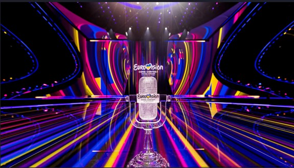   

            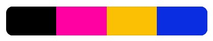  

    -   #### Typography
        -   The 'Protest Riot' is font used for the 'Eurovision Quiz!' heading while 'Sans-serif' is used for other content and also serving as the fallback font.

            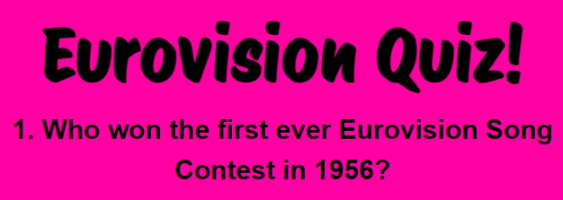

    -   #### Wireframes

        #### Mobile

        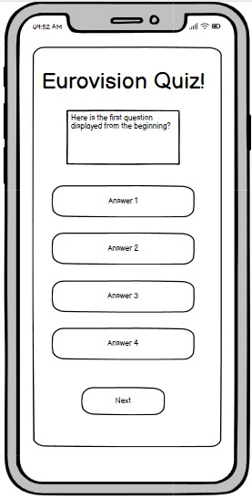
        
        #### Tablet

        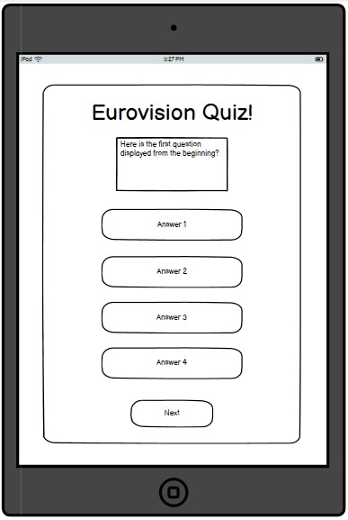
        

        #### Laptop

        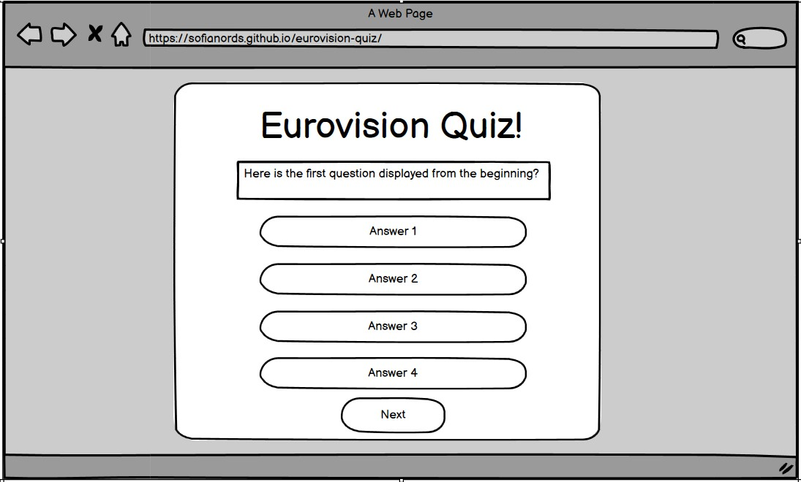


## Features

- Start quiz

    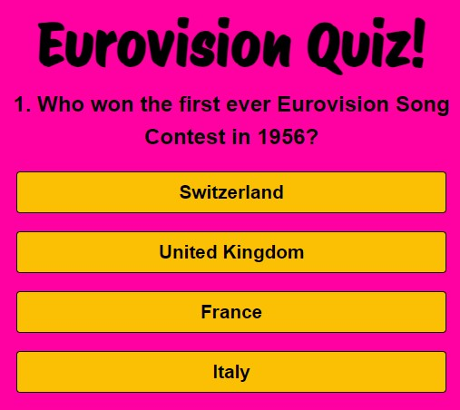

    The first question is visible when the user enters the website. The question number and score is reseted to 0 and the 'next-button' is hidden. 

- Correct vs Incorrect answer

    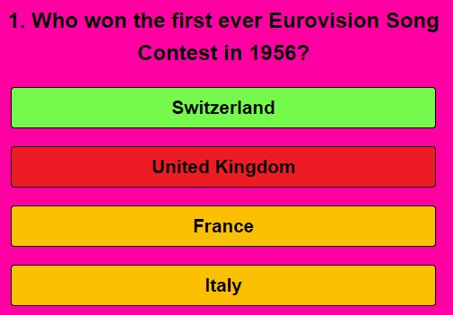

    If the user select the correct answer the background colour of the button turns green and the score increments. 
    
    If the user select the incorrect answer the backgroundcolour of the button turns red and the background colour of the button with the correct answer turns green. 
    
    When an answer is selected all the 'answer-buttons' are disabled.

- The 'next-button'

    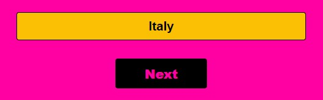

    When the user select an answer the 'next-button' appears.


- Next question

    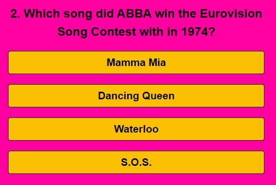

    When the user click the 'next-button' the quiz resets for the next question and hides the 'next-button' again. The reseteState function removes the 'answer-buttons'.
    
    The next question appears and new buttons are created with the answers related to the current question.


- The end of the quiz

    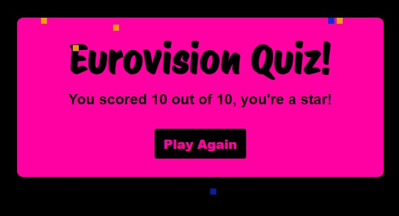

    When user click the 'next-button' after question number 10 the resetState removes the 'answer-buttons' and change the innerHTML of the 'next-button' to 'Play Again'.

    The scores shows and depending on how well the user played different messeges displays. If the user scores more then 9 points confetti appears.


- JavaScript Array forEach()

    Since each question has four answer options that should generate buttons with the content from the 'questions' array, I used the array forEach() method. 

    https://www.w3schools.com/jsref/jsref_forEach.asp

- Confetti

    The createConfetti() function was inspired by this tutorial:

    https://dev.to/devlawrence/creating-a-confetti-effect-from-scratch-using-html-css-and-javascript-4poi
    

- Other features

    The page is responsive on all devices.


### Future features

- An 'info button' with pop-up function in the header with an instruction about the quiz.

- A background image.

- A musicplayer that plays Eurovision songs.

## Technologies Used

### Languages Used

-   [HTML5](https://en.wikipedia.org/wiki/HTML5)
-   [CSS3](https://en.wikipedia.org/wiki/Cascading_Style_Sheets)
-   [JavaScript](https://en.wikipedia.org/wiki/JavaScript)

### Frameworks, Libraries & Programs Used

1. [Google Fonts:](https://fonts.google.com/)
    - Google fonts were used to import the 'Protest Riot' font.
1. [Git:](https://git-scm.com/)
    - Git was used for version control by utilizing the Gitpod terminal to commit to Git and Push to GitHub.
1. [GitHub:](https://github.com/)
    - GitHub is used to store the projects code after being pushed from Git.
1. [Favicon:](https://favicon.io/)
    - The 'favicon.io' page was used to downoload the musical note, which is used as the favicon on the webpage.
1. [Balsamiq:](https://balsamiq.com/)
    - The wireframes are created in Balsamiq.
1. [Coolors:](https://coolors.co/)
    - Coolors was used to create a colour palette based on the colours extracted from the Eurovision image.

## Validator Testing

The W3C Markup Validator, W3C CSS Validator and JSHint Services were used to validate the project to ensure there were no syntax errors in the project.

#### Html

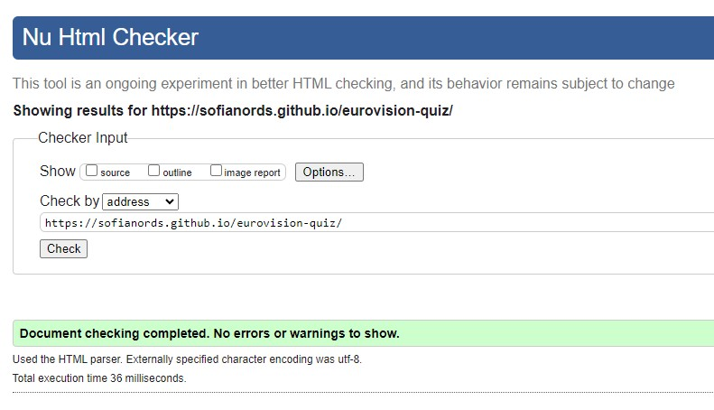

#### CSS

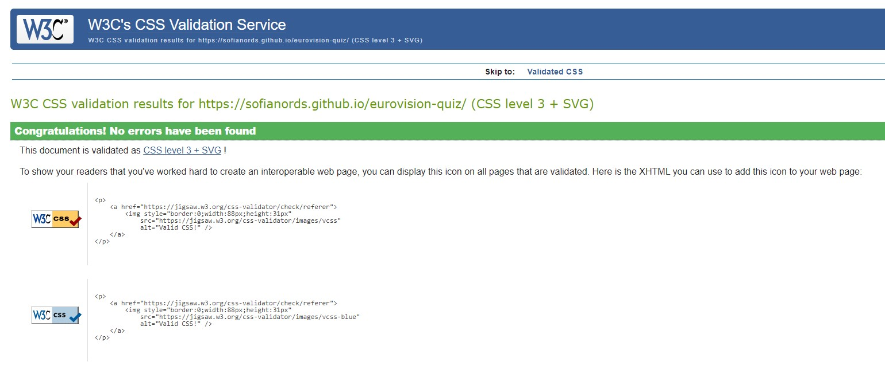

#### JavaScript

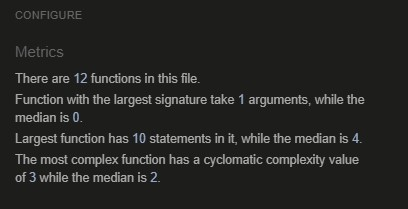

## Lighthouse Testing

The Lighthouse report from Google Chrome DevTools showed very good results for Performance, Accessibility, SEO and best practises of the site.

#### Mobile

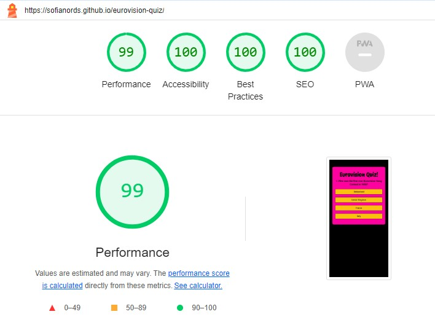

#### Desktop

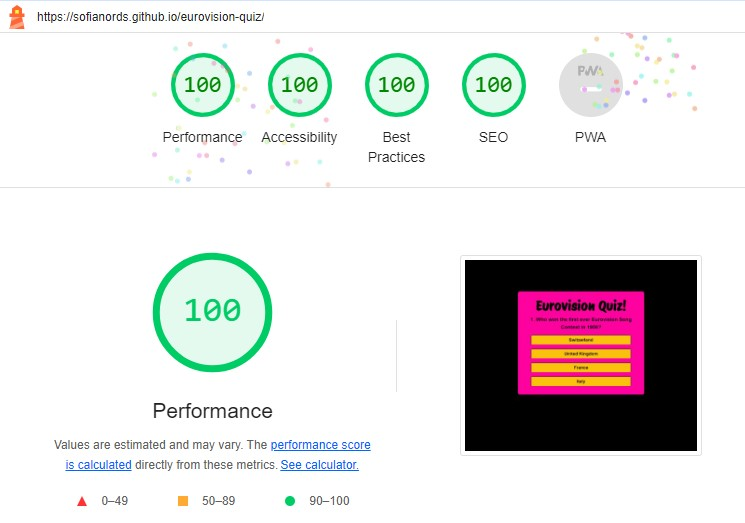


-   #### User Goals

    Start the Quiz Effortlessly:
        
        a. Users can seamlessly begin the quiz without any need for explicit instructions. The intuitive interface guides them through the process.

        - The first thing users see when they visit the website is the     initial quiz question along with the four answer options. Intuitively, users know they should click on one of the selectable alternatives.


        b. View Performance Scores and Feedback:
    
        Clear feedback indicates whether their answer is correct or incorrect.
        
        If a user answers incorrectly, the correct answer is provided, helping them learn from their mistakes.

        Participants receive their quiz scores, enabling them to assess   their performance.

        Depending on how the user performs, the feedback will be costumized.
    
        - When the user clicks on an answer option, the background colour changes to green if the answer is correct or to red if the answer is incorrect. If the selected option is incorrect, the background colour of the correct answer also changes, allowing the user to learn what is right. At the end of the quiz, the user receives their result along with a comment tailored to their performance.
    
   

        c. Unlimited Retries:
            
        Users enjoy the freedom to retake the quiz as many times as they desire. Whether aiming for improvement or simply having fun, unlimited retries enhance the user experience.

        - When the user has answered all the questions and their scores are displayed, the 'Play Again' button is also activated. If the user clicks the 'Play Again' button, the quiz reloads, and the user sees the first question in front of them again.

### Further Testing

-   The Website was tested on Google Chrome, Microsoft Edge and Safari browsers.
-   The website was viewed on a variety of devices such as Desktop, Laptop, iPhone SE, iPhone 11 & Galaxy Fold.
-   A large amount of testing was done to ensure that all JavaScript functions work as intended.


## Deployment

### GitHub Pages

The project was deployed to GitHub Pages using the following steps...

1. Log in to GitHub and locate the [GitHub Repository](https://github.com/SofiaNords/beach-club)
2. At the top of the Repository (not top of page), locate the "Settings" Button on the menu..
3. Scroll down the Settings page until you locate the "GitHub Pages" Section.
4. Under "Source", click the dropdown called "None" and select "Deploy from a branch".
5. The page will automatically refresh.
6. Scroll back down through the page to locate the now published site [Tjuvkil Beach](https://sofianords.github.io/beach-club/) in the "GitHub Pages" section.

### Forking the GitHub Repository

By forking the GitHub Repository we make a copy of the original repository on our GitHub account to view and/or make changes without affecting the original repository by using the following steps...

1. Log in to GitHub and locate the [GitHub Repository](https://github.com/SofiaNords/beach-club)
2. At the top of the Repository (not top of page) just above the "Settings" Button on the menu, locate the "Fork" Button.
3. You should now have a copy of the original repository in your GitHub account.

### Making a Local Clone

1. Log in to GitHub and locate the [GitHub Repository](https://github.com/)
2. Under the repository name, click "Clone or download".
3. To clone the repository using HTTPS, under "Clone with HTTPS", copy the link.
4. Open Git Bash
5. Change the current working directory to the location where you want the cloned directory to be made.
6. Type `git clone`, and then paste the URL you copied in Step 3.

```
$ git clone https://github.com/YOUR-USERNAME/YOUR-REPOSITORY
```

7. Press Enter. Your local clone will be created.

```
$ git clone https://github.com/YOUR-USERNAME/YOUR-REPOSITORY
> Cloning into `CI-Clone`...
> remote: Counting objects: 10, done.
> remote: Compressing objects: 100% (8/8), done.
> remove: Total 10 (delta 1), reused 10 (delta 1)
> Unpacking objects: 100% (10/10), done.
```

Click [Here](https://help.github.com/en/github/creating-cloning-and-archiving-repositories/cloning-a-repository#cloning-a-repository-to-github-desktop) to retrieve pictures for some of the buttons and more detailed explanations of the above process.

## Credits

### Content

-   All content was written by the developer.

### Acknowledgements

-   My Mentor, Spencer Barriball, for continuous helpful feedback.

-   Tutor support at Code Institute for their support.
